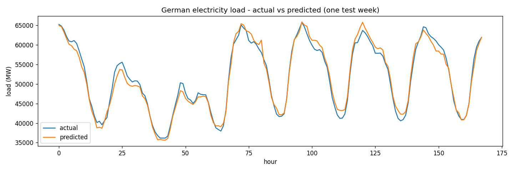

# German Electricity Load Forecasting

I built a model that predicts **Germany's hourly electricity demand** from historical
data. It loads six years of real load data, explores the daily and seasonal patterns,
engineers time-based and lag features, and trains a gradient-boosting model — evaluated
honestly with a time-based train/test split.

## Results

| Metric | Value |
|---|---|
| R² (variance explained) | **0.951** |
| Mean Absolute Error | **1,375 MW** (~2.5% of average load) |



The model tracks the daily demand wave and the weekend dip closely.

## Approach

1. **Data** — hourly German load, Jan 2015 → Sep 2020 (50,400 rows), from the free
   [Open Power System Data](https://open-power-system-data.org/) time series.
2. **Exploration** — demand is lowest overnight (~44 GW) and peaks mid-morning (~64 GW),
   and is higher in winter than summer. These patterns guided the features.
3. **Features** — hour, day of week, month, weekend flag, and two **lag features**:
   the load 24 hours ago (same hour yesterday) and 168 hours ago (a week ago). Lags are
   the strongest predictors, since demand repeats daily and weekly.
4. **Model** — `HistGradientBoostingRegressor` (scikit-learn).
5. **Evaluation** — a **time-based split** (train on the earliest 80%, test on the most
   recent 20%). I avoided a random split on purpose: shuffling would let the model see
   future data during training (data leakage) and overstate its accuracy.

## Run it

```bash
python -m venv .venv
.venv\Scripts\activate        # Windows
pip install -r requirements.txt
python energy_model.py
```

The first run downloads the dataset (~130 MB) and caches a small CSV, so later runs are
instant. It prints the metrics and saves `forecast.png`.

## What I learned

- Lag features can carry most of the signal in a time series — simple, but powerful.
- For forecasting you must split by time, not randomly, or your scores lie.
- How to go from a raw public dataset to a clean, validated model end to end.

## Possible extensions

Add weather (temperature drives heating/cooling demand) and public holidays, forecast
further ahead than one hour, or compare against a naive "same hour last week" baseline.

---
*Tech: Python, pandas, scikit-learn, matplotlib.*
